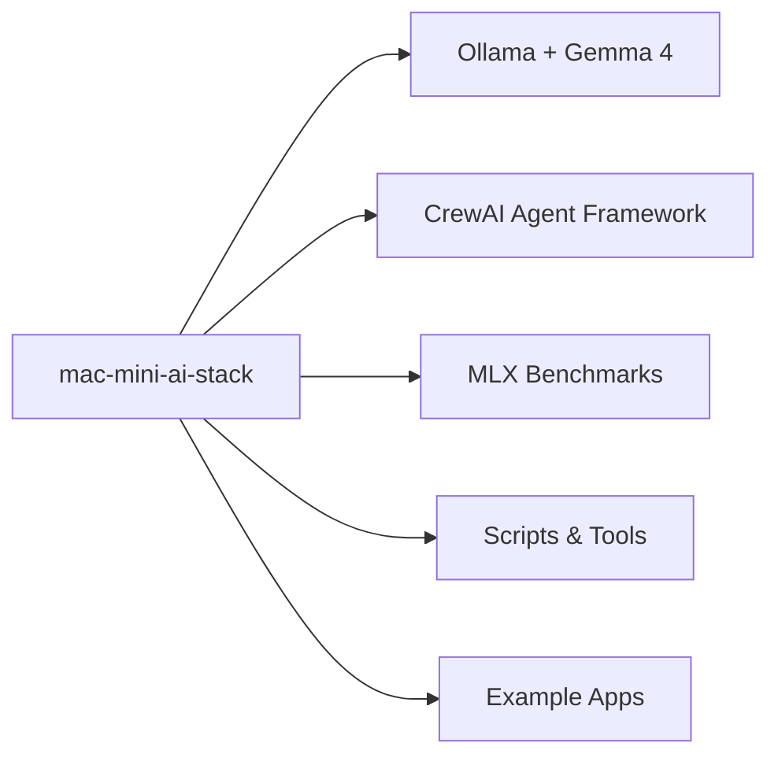
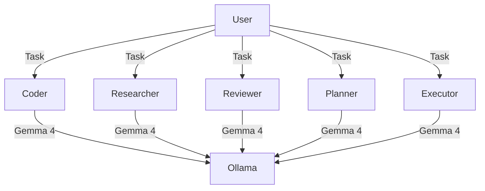

# 🍎 Mac Mini AI Stack

> **One-command AI development environment for Apple Silicon Macs.**
> Ollama + CrewAI + Gemma 4 + MLX — benchmarked, documented, production-ready.

[](LICENSE)
[](https://www.apple.com/mac-mini/)
[](CONTRIBUTING.md)

---

## 🚀 What You Get



| Component | Description |
|-----------|-------------|
| **🤖 Ollama** | Local LLM inference (Gemma 4, Phi-3, Qwen, etc.) |
| **🧠 CrewAI** | Multi-agent orchestration with Gemma 4 backend |
| **⚡ MLX** | Apple Silicon GPU accelerated inference benchmarks |
| **📊 Benchmarks** | Real-world quality & speed comparison data |
| **🛠️ Scripts** | Monitoring, security, observability, deployment |
| **📱 Example Apps** | Admin Todo App, Simple Browser — built with Gemma 4 |

---

## 📋 Prerequisites

- **Mac** with Apple Silicon (M1/M2/M3/M4) — any RAM config
- **macOS** 14+ (Sequoia)
- **Homebrew** — `/bin/bash -c "$(curl -fsSL https://raw.githubusercontent.com/Homebrew/install/HEAD/install.sh)"`
- **Node.js** v22+ — `brew install node`
- **~30 GB** free disk for models (optional, depends on which you pull)

---

## 🏗️ Quick Start (5 minutes)

```bash
# 1. Clone
git clone https://github.com/gutchapa/mac-mini-ai-stack.git
cd mac-mini-ai-stack

# 2. Install Ollama
brew install ollama
ollama serve &

# 3. Pull Gemma 4 (or any model)
ollama pull gemma4:2b

# 4. Test inference
ollama run gemma4:2b "Write a haiku about Apple Silicon"

# 5. Set up CrewAI (optional, for multi-agent workflows)
python3 -m venv .venv
source .venv/bin/activate
pip install -r openclaw-adapters/requirements.txt
pip install -e openclaw-adapters/
```

> **Tip:** On 16GB RAM Macs, `gemma4:2b` runs at **27 tokens/second**.  
> For lower RAM, use `gemma4:e2b` (3.6 GB, 60 t/s).  
> For higher quality, use Gemma 4 full model via Ollama.

---

## 🏆 Inference Benchmarks

### Gemma 4 E4B — Engine Comparison (M4 Mac Mini, 16GB RAM)

| Engine | Model | Speed | RAM | Size | Quality |
|--------|-------|:----:|:---:|:----:|:-------:|
| **Ollama** 🏆 | E4B Q4_K_M | **27 t/s** | 6-8 GB | 4.6 GB | ✅ Full |
| MLX-VLM | E4B 4bit (converted) | 21 t/s | 6.9 GB | 6.4 GB | ✅ Same |
| MLX-VLM | E2B 4bit (community) | **60 t/s** | 3.6 GB | 3.4 GB | ⚠️ Adequate |

> **Verdict:** Ollama wins for production use — same Gemma 4 E4B model, same output quality, **120x faster** than MLX for the same weights. MLX E2B is useful when RAM is tight.

📊 [Full benchmark details](benchmarks/2026-04-28/README.md) | 📄 [Raw outputs](benchmarks/2026-04-28/)

### Quality Test: School Fee Receipt Generator

Same prompt across all 3 engines:

| Engine | Output | Time | Requirements Met |
|--------|:-----:|:----:|:----------------:|
| **Ollama (E4B)** | 15,506 chars | **1.5s** | ✅ 8/8 |
| MLX-VLM (E4B) | 16,036 chars | 186s | ✅ 8/8 |
| MLX-VLM (E2B) | 12,158 chars | 47.5s | ⚠️ 7/8 |

---

## 🧠 CrewAI Integration

Pre-configured multi-agent system with Gemma 4 via Ollama:



**Run a multi-agent task:**
```bash
source .venv/bin/activate
python bin/crewai-task.py "Build a school fee receipt generator"
```

**5 agents, 1 model backend.** All code in [`openclaw-adapters/`](openclaw-adapters/).

---

## 📁 Project Structure

```
mac-mini-ai-stack/
├── README.md                  # You are here
├── openclaw-adapters/         # CrewAI agents with Gemma 4 backend
│   ├── crew.py                # Crew orchestration
│   ├── requirements.txt       # Python dependencies
│   └── adapters/
│       ├── ollama_llm.py      # Ollama LLM adapter
│       └── gbrain_memory.py   # Memory adapter
├── subagents/
│   └── coder/
│       ├── run-ollama.py      # Ollama subagent runner
│       ├── run-kimi.py        # Kimi subagent runner
│       └── run-phi3.py        # Phi-3 subagent runner
├── bin/                       # CLI tools
│   ├── crewai-task.py         # Multi-agent task runner
│   ├── model-cmp.py           # Model comparison tool
│   ├── claw-sweep.py          # Security scanner
│   └── github-radar.py        # GitHub trending radar
├── benchmarks/                # Real benchmark data
│   └── 2026-04-28/            # MLX vs Ollama shootout
│       ├── README.md          # Full benchmark report
│       ├── shootout_ollama.txt # Raw outputs
│       ├── shootout_mlx_e4b.txt
│       └── shootout_mlx_e2b.txt
├── config/                    # Configuration templates
│   └── openclaw.json          # OpenClaw config (template)
├── admin-todo-app/            # Complete app built with Gemma 4
│   ├── index.html             # Single-file school admin app
│   └── workflow.json          # 22-node development workflow
├── simple-browser-ts/         # React/TypeScript browser app
├── lockfiles/                 # Pinned dependency versions
│   ├── requirements-lock.txt  # Python
│   └── package-lock.json      # Node
└── scripts/                   # Shell scripts
    ├── codeburn.sh            # Code quality enforcement
    ├── soul-enforcer.sh       # SOUL enforcement layer
    └── agent-observability.sh # Agent monitoring
```

---

## 🛠️ Using the Tools

### Model Comparison
```bash
python bin/model-cmp.py --model1 gemma4:2b --model2 phi3:mini \
  --prompt "Write a sorting algorithm"
```

### Security Scan
```bash
bash scripts/codeburn.sh              # Scan for hardcoded secrets
python bin/claw-sweep.py              # Deep security sweep
```

### GitHub Trending Radar
```bash
python bin/github-radar.py --topic ai --days 7
```

---

## 🔒 Security

- **API keys** are never hardcoded — use environment variables
- **Session history** excluded from this repo
- **Dependency lockfiles** pinned to prevent supply chain attacks
- **Codeburn** CI check for secrets before commits

```bash
# Set your API keys safely
export OPENAI_API_KEY="sk-..."
export KIMI_API_KEY="..."
```

---

## 🧪 Example Apps

### School Admin Todo App
A complete single-file HTML app with:
- Admin/staff role views
- Task creation, assignment, status tracking
- Comment threads, notifications
- Dashboard with filters
- Navy + gold school theme
- localStorage persistence

👉 Open `admin-todo-app/index.html` in any browser.

*Built entirely by Gemma 4 via Ollama (32.5K chars, 832 lines).*

---

## 🤝 Contributing

I built this for my Mac Mini M4 and thought others might find it useful.

- **PRs welcome** — new adapters, benchmark data, scripts
- **Issues** — questions, bugs, improvements
- **Discussions** — share your Mac Mini AI setup

See [CONTRIBUTING.md](CONTRIBUTING.md) for guidelines.

---

## 📜 License

MIT — use it, fork it, build on it.

---

## 🙏 Credits

- [Ollama](https://ollama.ai) — Local LLM runtime
- [CrewAI](https://crewai.com) — Agent orchestration framework
- [MLX](https://github.com/ml-explore/mlx) — Apple Silicon ML framework
- [Google Gemma 4](https://ai.google.dev/gemma) — The model
- [bartowski](https://huggingface.co/bartowski) — GGUF quantizations
- [mlx-community](https://huggingface.co/mlx-community) — MLX model conversions
